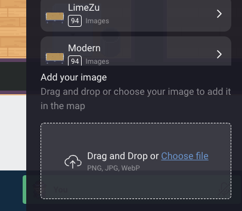
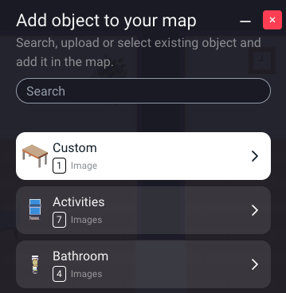
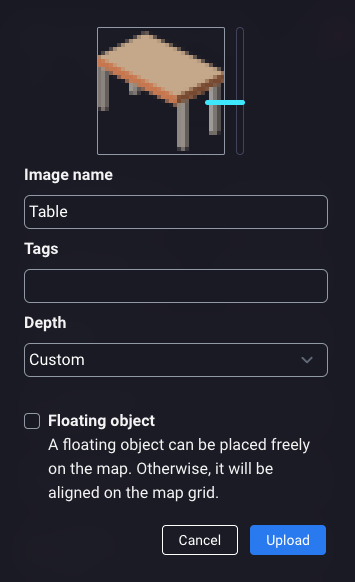
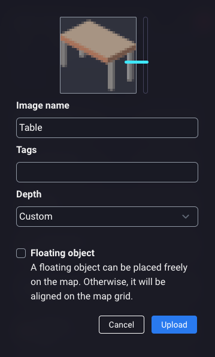

# Placing Objects and Furniture

Are you moving into your new virtual office? Or are you organizing a conference? In any case, you will need to place
objects and furniture in your map.

## The entity editor

Use the entity editor to drag'n'drop objects from the right panel into the map.

<iframe width="100%" height="480" src="https://www.youtube.com/embed/WfGBxyVctgY?si=-PP8ymTmDRXmWXGd" title="YouTube video player" frameborder="0" allow="accelerometer; autoplay; clipboard-write; encrypted-media; gyroscope; picture-in-picture; web-share; fullscreen" allowfullscreen></iframe>

Some objects can be rotated (top, left, bottom, right).
Some objects can have different colors.

When you click on an object, you can attach a number of actions in the right panel.

## Objects name

Objects can have a name.
The name of the object is displayed in a pop-up when users click on the object.

## Attaching actions to objects

When you add an action to an object, the object becomes "clickable" by users.
When a user clicks on the object, a pop-up is displayed with the list of possible actions.

Possible actions are:

- **[Opening a link](open-link.md)**: Opens a webpage, either inside WorkAdventure or in a new tab of the browser.
- **[Opening a videoconference](jitsi.md)**: Opens a Jitsi video conference inside WorkAdventure. You could for instance attach
  a videoconference to a phone or a phonebooth inside your map that would connect you to a Jitsi room in another
  part of the map.
- **[Play an audio file](play-sound.md)**: Plays an audio file. Useful for Jukeboxes!

## Snapping objects to the grid

When placing objects on the map, you can place most objects in a "pixel perfect" way.
If you hold the SHIFT key, objects will be "snapped" to the grid.

WorkAdventure will force any "colliding" objects to be snapped to the grid. This means that if an object cannot be
traversed (like a table), WorkAdventure will make it snap to the grid. This is a limitation of the physics engine
used internally by WorkAdventure.

## Deleting an object

You can delete an object by selecting it and pressing the `Delete` key on your keyboard.
Alternatively, if you have many objects to delete, you can select the "delete tool" (the bin icon) in the toolbar and
click on the objects you want to delete.

## Uploading an object

You can upload your custom object and place them on your map.

To upload an object, open the Entity editor and click on the upload zone at the bottom. You can also drag/drop your object image in the upload zone.

You will see the upload form allowing you to configure your asset <strong>BEFORE</strong> upload.

In this form you can :

- Define the asset name
- Add tags (separated by a comma)
- Define object depth
- Define the object as "floating object"

Once your object is uploaded, you can access it by searching it or click on "Custom" category in entity list.

### Object depth

Object depth is a way to define how your Woka will be displayed while walking through the object. You can use depth preset or define your own by selecting "Custom".

- Standing : Your Woka will be displayed behind the object
- On the floor: Your Woka will walk through the object
- Custom : Move the blue selector near the object to define the point where the Woka will be displayed behind the object

### Floating object

By default, a custom object can be placed on the map guided by a grid. By leaving this parameter unchecked, you can click on the image to define the collide parameter (define if your Woka can walk through the object or he need to walk around it).
If you check the parameter, the custom object can by placed freely on the map and you will not have the opportunity to define collide.

Note : This parameter is <strong>NOT EDITABLE</strong> after upload. A floating object will never have a collide edition.

## Editing an object

On the entity editor your can edit your custom objects. Included defaults objects are not editable.
To edit a custom object, select it and click on "edit" button.

You will see an edit form on wich you can :

- Edit name name
- Add/remove tags
- Edit depth ([learn more](#object-depth))
- Remove object (this action will also remove the object on the map if it was already placed)

Do not forget to save your modifications by clicking on the "Save" button.

## Frequently Asked Questions

### Can I import my own objects?

As of now, it is not possible to import your own objects in the inline map editor using a graphical interface.
This will come in future releases, as we extend the capabilities of the inline map editor.

However, if you are a die-hard fan and are not afraid of doing some technical work, you can define your own object
collections by writing a JSON file and then manually modifying the map file (with the `.wam` extension) to add a
reference to your JSON object collection.

You can read more about the entity collection format in the [documentation](../entity-collection-file-format.md).

### I cannot move or select an object on the map

If you cannot move or select an object on the map, it is probably because the object is part of the Tiled map (the `.tmj` file).
In order to move or select an object, it must be created from the inline map editor.

If the object is a sprite part of the Tiled map, you won't be able to move it. You will have to delete it from the Tiled
map and recreate it in the inline map editor.
